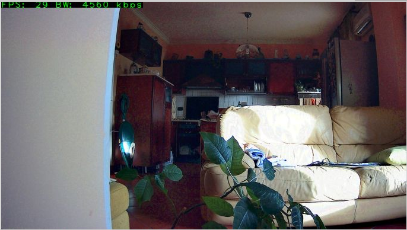
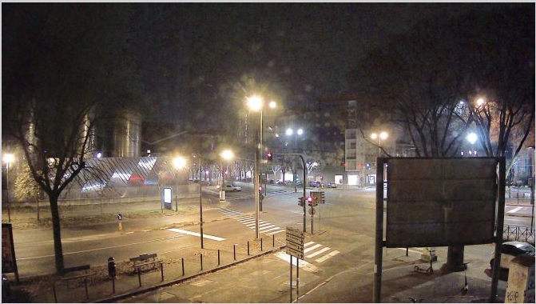
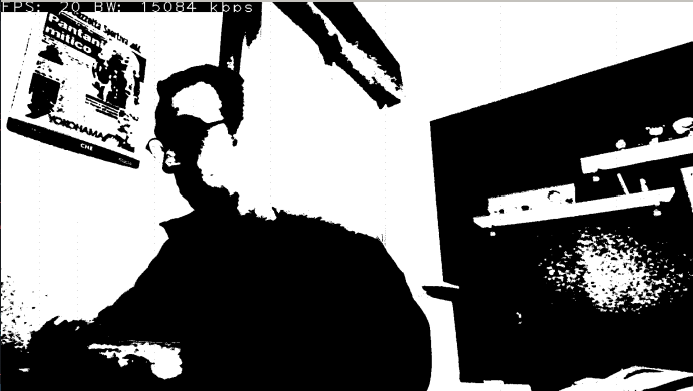

# Webcam streaming \& filters

### Introduction

A classical video streaming algorithm over internet or over any other communication channel is based on the concept of sending not frame by frame as they are but instead they are based on sending the first frame and then the difference between the new one and the previous, where difference here is to be indended pixel-by-pixel difference.

If this can be arguable for video with a lower resolution, the heaviness of sending each frame as it is for high video resolution is notable. Let's take as an example a FULL HD video, means that each frame is composed of 1920x1080 pixels where 1920 is the width of the frame while 1080 is the height. Supposing the frame is in RGB24 format, means that each pixel is rapresented by 3 byte (one for each channel R, G, and B).

By doing a rapid computation, each frame measures 3 * 1920 * 1080 B = 6220800 B = 5.93 MB. Supposing now the video used by example is a 30 fps video, means that each second we have 30 frame, each of one measures 5.93 MB: each second we are sending about 178 MB. To send 178 MB/s we need a transfer link bandwith of 1492 Mbps, that is unfeasible.

So the solution is to send the difference, and this means sending only the pixels that change or, better, pixels where their difference is above a certain threshold. 

### The goal

The purpose of the project is to demonstrate the performances that are obtainable by computing the difference on a CPU and to compare them with the ones obtainable by using a General Purpose GPU or *GPGPU*. A Nvidia GPU will be used for the benchmark and therefore the code will be based on CUDA. Among all these considerations, different filters will be added in order to demonstrate the potentiality of GPGPU computations on video elaboration and streaming.
|             |  |
:-------------------------:|:-------------------------:
  |  
  |  
  |  

## Build and Run

This project is splitted into two parts: a client and a server. In the project root folder there are two main directories named as the two parts mentioned. Thanks to the use of GNU Make utility, is possibile to build and run the project in an easy way. 

Please remember that OpenCV is needed in order to build and run the project. If apt is used as package manager, it's possible to install it with 
```sh
sudo apt install libopencv-dev
```
If this is not the case, is possible to compile and install OpenCV from the source by referring to the <a href="https://docs.opencv.org/4.x/d7/d9f/tutorial\_linux\_install.html">official documentation</a>. *Tested with OpenCV 4.1.1*.

The Makefiles are organized in order to compile only the changed files, in this way is possible to speed up the compilation time during the development by compiling only the modules that have been changed. Moreover, different compilers are used for different source files: the ones with extension *.cu are compiled used nvcc while the ones ending with *.cpp are compiled with g++. At the end, a link step is performed using nvcc.

In particuar, in the root folder is possible to launch these two commands:

* ```make server```: builds and execute the server
* ```make client```: builds and execute the client
* ```make clean```:  cleans the build output files both for server and client

Launching the make command inside the \textit{server} directory is possible to use more make targets:

* ```make build```: builds the server
* ```make run: ```builds and run the server
* ```make prof:``` builds and run the server with use of Nvidia profiler
* ```make debug```: builds and run the server using gdb to debug the host coderun
* ```make clean```: cleans the build output files
               
If a multi-core device is used, is possible to compile the server in a parallel way, this allows to reduce the compilation time by almost an half of the sequantial time, for example (supposing to be inside the server folder and 4 cores are available): ```make -j 4 prof```.
